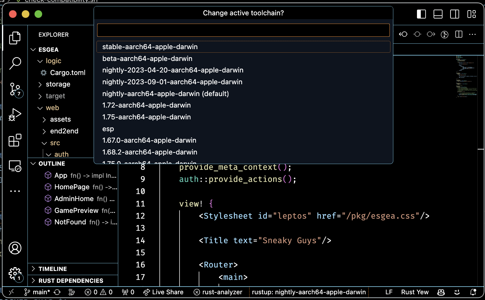

# vscode-rustup

A simple status bar item to show the current rustup channel, and a command for setting the override. Will periodically remind when `rustup update` reports any toolchain has an update ready. 

## Features

When a Rust file is open, a status bar item showing the current rustup toolchain will display on the left. Click it, and you will be able to select an argument that will be used with `rustup override set`.

## Requirements

Needs rustup to be installed.

## Extension Settings

**`rustup.updateInterval`: number** - how often to check for updates in hours. Defaults to 24.
**`rustup.path`: string** - where to find rustup. Defaults to searching PATH.

## Help Wanted

If rustup isn't installed, may complain and throw errors. Maybe it should offer or explain how to install rustup instead?

Update selection quickpick is ugly and could use some styling instead of using raw ascii.